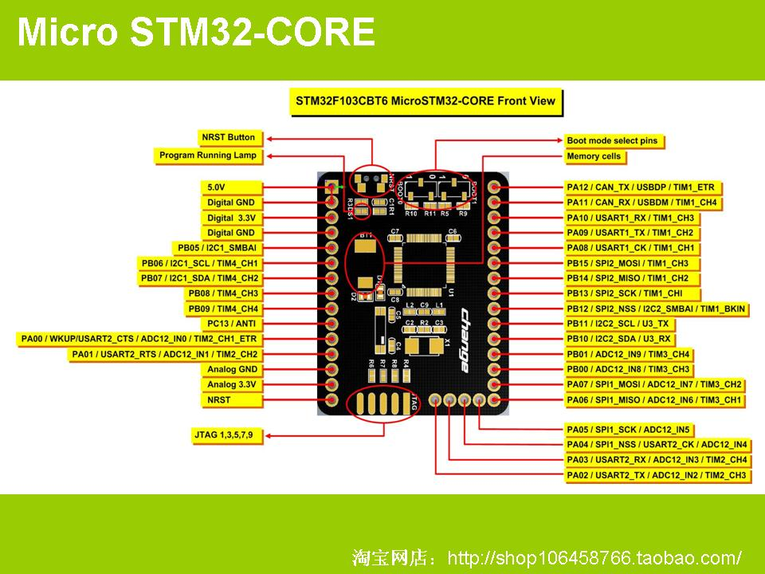

# tinyStm32
This toy I bought from [TaoBao](https://shop106458766.taobao.com/).
- Pros
  - Tiny
  - Rich peripheral boards
- Cons
  - Small memory

## STM32F103CB
- 72MHz
- 128K ROM
- 20K RAM

## Documents
- [PPT from seller](doc)

